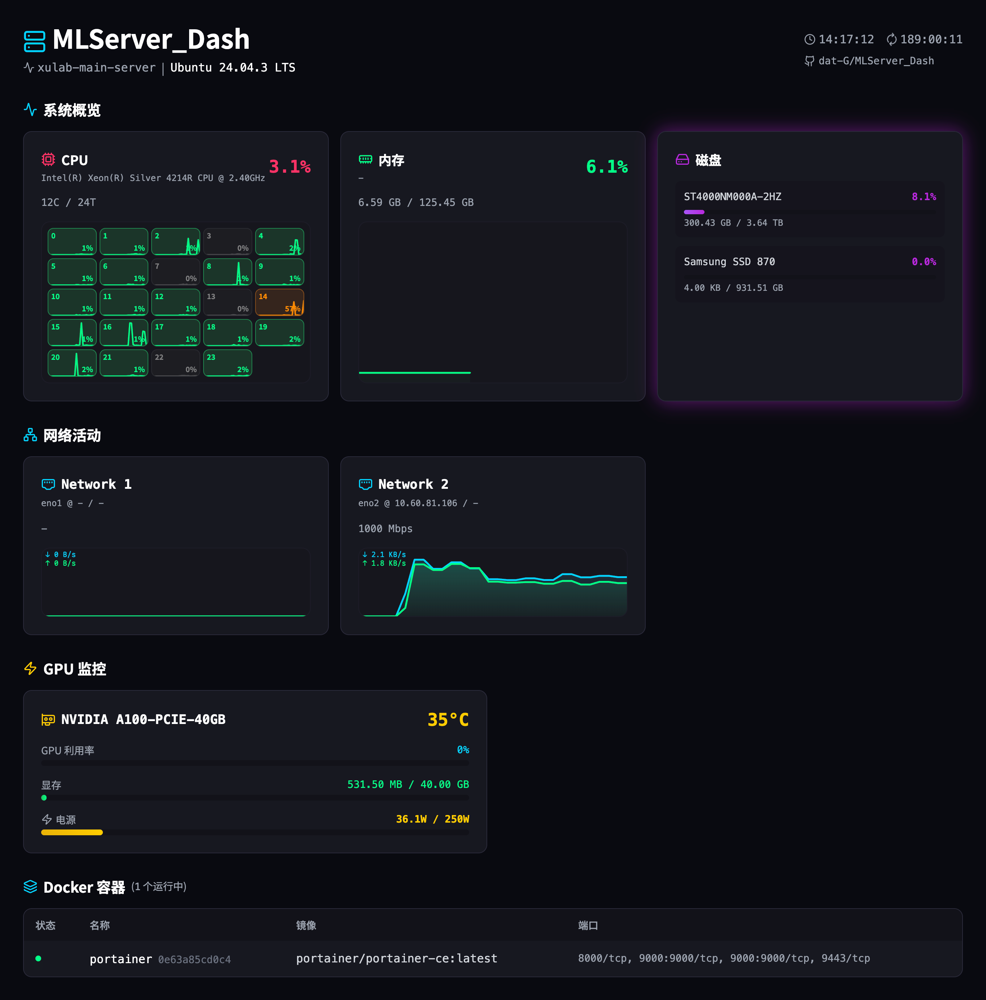

# MLServer_Dash

<div align="center">


**A modern, real-time server monitoring dashboard with GPU support**

[Features](#-features) • [Demo](#-quick-start) • [Installation](#-installation) • [Configuration](#-configuration) • [API](#-api-documentation)

</div>

---

## Overview

**MLServer_Dash** is a comprehensive server monitoring solution designed for machine learning workstations and production servers. It provides real-time visualization of system resources including CPU, memory, disk, network, and NVIDIA GPU metrics with a beautiful cyber-punk themed interface.

## Features

<div align="center">



</div>

- Real-time CPU monitoring with per-core utilization
- Memory usage with model information
- Physical disk monitoring with smart detection
- NVIDIA GPU monitoring (utilization, temperature, power usage, memory)
- Network activity with dual-line sparkline charts (upload/download)
- Docker container management (start/stop/restart)
- Responsive design with cyber-punk theme
- Zero configuration required

## Tech Stack

### Backend
- **FastAPI** - Modern, fast web framework for building APIs
- **psutil** - Cross-platform system monitoring
- **pynvml** - NVIDIA GPU monitoring
- **docker** - Docker container management

### Frontend
- **React 18** - UI library
- **Vite** - Next generation frontend tooling
- **Tailwind CSS** - Utility-first CSS framework
- **lucide-react** - Beautiful icons
- **Canvas API** - Custom sparkline charts

## Prerequisites

Choose one of the following installation methods:

**For Manual Installation:**
- **Python**: 3.8 or higher
- **Node.js**: 16.x or higher

**For Docker Installation:**
- **Docker**: 20.x or higher
- **Docker Compose**: v2.x or higher

**Optional:**
- **NVIDIA GPU** - For GPU monitoring
- **NVIDIA Container Toolkit** - For GPU monitoring in Docker

## Quick Start

### Option 1: Using Start Script (Linux/macOS)

```bash
git clone https://github.com/dat-G/MLServer_Dash.git
cd MLServer_Dash
chmod +x start.sh
./start.sh
```

Access the dashboard at `http://localhost:5173`

### Option 2: Manual Installation

#### Backend Setup

```bash
cd backend
python -m venv venv
source venv/bin/activate  # On Windows: venv\Scripts\activate
pip install -r requirements.txt
python main.py
```

#### Frontend Setup

```bash
cd frontend
npm install
npm run dev
```

Access the dashboard at `http://localhost:5173`

### Option 3: Docker Compose

```bash
# Clone the repository
git clone https://github.com/dat-G/MLServer_Dash.git
cd MLServer_Dash

# (Optional) Configure ports
cp .env.example .env
# Edit .env to customize FRONTEND_PORT and API_PORT

# Start all services
docker-compose up -d

# View logs
docker-compose logs -f

# Stop services
docker-compose down
```

Access the dashboard at `http://localhost:5173`

**Note:** For GPU monitoring in Docker, ensure you have the [NVIDIA Container Toolkit](https://github.com/NVIDIA/nvidia-docker) installed.

## Configuration

All configuration is centralized in `config.json` at the project root:

```json
{
  "app": {
    "appName": "MLServer_Dash",
    "githubUrl": "https://github.com/dat-G/MLServer_Dash"
  },
  "backend": {
    "host": "0.0.0.0",
    "port": 8000,
    "corsOrigins": ["*"],
    "corsMethods": ["GET", "POST", "PUT", "DELETE"],
    "pollInterval": 2000,
    "historySize": 30
  },
  "frontend": {
    "port": 5173,
    "apiHost": "localhost",
    "apiPort": 8000
  }
}
```

### Configuration Options

| Option | Type | Default | Description |
|--------|------|---------|-------------|
| `app.appName` | string | `"MLServer_Dash"` | Application name (used in UI and API) |
| `app.githubUrl` | string | GitHub URL | Project repository link |
| `backend.host` | string | `"0.0.0.0"` | Backend bind address |
| `backend.port` | number | `8000` | Backend port |
| `backend.corsOrigins` | array | `["*"]` | Allowed CORS origins (`["*"]` for all) |
| `backend.pollInterval` | number | `2000` | Poll interval in milliseconds |
| `backend.historySize` | number | `30` | Number of history data points for charts |
| `frontend.port` | number | `5173` | Frontend development server port |
| `frontend.apiHost` | string | `"localhost"` | API host for frontend |
| `frontend.apiPort` | number | `8000` | API port for frontend |

## API Documentation

### Base URL
```
http://localhost:8000
```

### Endpoints

#### Get System Information
```http
GET /api/system
```

Returns comprehensive system metrics.

**Response Example:**
```json
{
  "hostname": "ml-server-01",
  "os": "Linux 6.14.0-37-generic",
  "distro": {
    "name": "Ubuntu 24.04 LTS",
    "id": "ubuntu"
  },
  "cpu": {
    "brand": "AMD Ryzen 9 7950X 16-Core Processor",
    "percent": 25.4,
    "cores": 16,
    "threads": 32,
    "per_core_percent": [20.5, 18.2, 22.1, ...]
  },
  "memory": {
    "total": 68719476736,
    "used": 34359738368,
    "free": 34359738368,
    "percent": 50.0,
    "total_human": "64.00 GB",
    "used_human": "32.00 GB",
    "free_human": "32.00 GB",
    "model": "Kingston Fury Beast"
  },
  "disks": [
    {
      "name": "Samsung 970 EVO Plus",
      "total": 1000204886016,
      "used": 500102400000,
      "free": 500102486016,
      "percent": 50.0
    }
  ],
  "gpu": [
    {
      "name": "NVIDIA GeForce RTX 4090",
      "memory": {
        "total": 25769803776,
        "used": 12884901888,
        "percent": 50.0
      },
      "utilization": 75.0,
      "temperature": 65,
      "power_usage": 350000,
      "power_tdp": 450000
    }
  ],
  "network": [
    {
      "name": "eth0",
      "model": "Intel Corporation I225-V",
      "speed": 1000,
      "ipv4": "192.168.1.100",
      "ipv6": "fe80::1",
      "speed_up": 1024000,
      "speed_down": 2048000
    }
  ],
  "uptime": 86400
}
```

#### Get Docker Containers
```http
GET /api/docker
```

Returns list of running Docker containers.

**Response Example:**
```json
[
  {
    "id": "a1b2c3d4e5f6",
    "name": "jupyterlab",
    "image": "jupyter/scipy-notebook:latest",
    "status": "running",
    "state": "running",
    "ports": "8888:8888"
  }
]
```

#### Container Actions
```http
POST /api/docker/{container_id}/action?action={action}
```

Control Docker containers.

**Parameters:**
- `container_id` (path) - Container ID or name
- `action` (query) - Action to perform: `start` | `stop` | `restart`

**Response:**
```json
{
  "success": true,
  "message": "Container a1b2c3d4e5f6 started"
}
```

#### Health Check
```http
GET /api/health
```

Check API health and available features.

**Response:**
```json
{
  "status": "healthy",
  "timestamp": "2025-12-24T10:30:00",
  "docker_available": true,
  "gpu_available": true
}
```

### Interactive Documentation

Once the backend is running:
- **Swagger UI**: `http://localhost:8000/docs`
- **ReDoc**: `http://localhost:8000/redoc`

## Project Structure

```
MLServer_Dash/
├── backend/
│   ├── main.py              # FastAPI application
│   ├── Dockerfile           # Backend container image
│   ├── requirements.txt     # Python dependencies
│   └── .dockerignore        # Docker build exclusions
├── frontend/
│   ├── src/
│   │   ├── App.jsx         # Main React component
│   │   └── main.jsx        # Entry point
│   ├── index.html
│   ├── package.json
│   ├── vite.config.js
│   ├── nginx.conf          # Nginx configuration for production
│   ├── Dockerfile          # Frontend container image
│   └── .dockerignore       # Docker build exclusions
├── config.json              # Unified configuration
├── docker-compose.yml       # Docker Compose orchestration
├── .env.example            # Environment variables template
├── start.sh                # Quick start script
├── LICENSE                 # MIT License
├── preview.png             # Screenshot
└── README.md
```

## Development

### Backend Development

```bash
cd backend
source venv/bin/activate
python main.py
```

### Frontend Development

```bash
cd frontend
npm install
npm run dev
```

### Build for Production

```bash
cd frontend
npm run build
```

Output: `frontend/dist/`

### Code Style

- **Python**: Follow PEP 8, use 4 spaces for indentation
- **JavaScript/React**: Follow Airbnb style guide
- **Commits**: Use conventional commit messages (`feat:`, `fix:`, `docs:`, etc.)

## Deployment

### Production Backend

Using gunicorn with uvicorn workers:

```bash
cd backend
pip install gunicorn
gunicorn -w 4 -k uvicorn.workers.UvicornWorker main:app --bind 0.0.0.0:8000
```

### Production Frontend

Build and serve with nginx:

```bash
cd frontend
npm run build
```

**nginx config:**
```nginx
server {
    listen 80;
    root /path/to/frontend/dist;
    index index.html;

    location / {
        try_files $uri $uri/ /index.html;
    }

    location /api/ {
        proxy_pass http://localhost:8000;
        proxy_set_header Host $host;
        proxy_set_header X-Real-IP $remote_addr;
    }
}
```

### Systemd Service (Linux)

**Backend service** (`/etc/systemd/system/mlserver-dash-backend.service`):
```ini
[Unit]
Description=MLServer_Dash Backend
After=network.target

[Service]
User=www-data
WorkingDirectory=/path/to/MLServer_Dash/backend
Environment="PATH=/path/to/MLServer_Dash/backend/venv/bin"
ExecStart=/path/to/MLServer_Dash/backend/venv/bin/gunicorn -w 4 -k uvicorn.workers.UvicornWorker main:app --bind 0.0.0.0:8000
Restart=always

[Install]
WantedBy=multi-user.target
```

Enable and start:
```bash
sudo systemctl enable mlserver-dash-backend
sudo systemctl start mlserver-dash-backend
```

## Troubleshooting

### GPU not showing up
- Verify NVIDIA drivers: `nvidia-smi`
- Install pynvml: `pip install nvidia-ml-py3`
- Check backend logs for errors

### Docker containers not showing
- Check docker service: `systemctl status docker`
- Add user to docker group: `sudo usermod -aG docker $USER`
- Restart shell after adding to group

### CORS errors
- Update `corsOrigins` in `config.json`
- For production, specify exact origins instead of `["*"]`

### Port already in use
```bash
# Linux/macOS
lsof -ti:8000 | xargs kill -9

# Windows
netstat -ano | findstr :8000
taskkill /PID <PID> /F
```

### Memory model not showing
- Requires sudo/root access to read dmidecode
- Run with elevated privileges or accept no model data

## Roadmap

- [ ] Dark/Light theme toggle
- [ ] Custom alerts and notifications (webhook, email)
- [ ] Historical data persistence (database)
- [ ] Multi-server monitoring support
- [ ] Export metrics (CSV, Prometheus)
- [ ] Authentication/Authorization
- [ ] Mobile app (React Native)
- [ ] Desktop app (Electron)

## Contributing

Contributions are welcome! Please feel free to submit a Pull Request.

1. Fork the repository
2. Create your feature branch (`git checkout -b feature/AmazingFeature`)
3. Commit your changes (`git commit -m 'Add some AmazingFeature'`)
4. Push to the branch (`git push origin feature/AmazingFeature`)
5. Open a Pull Request

## License

This project is licensed under the MIT License - see the [LICENSE](LICENSE) file for details.

## Acknowledgments

- [FastAPI](https://fastapi.tiangolo.com/) - The web framework used
- [React](https://react.dev/) - The UI framework
- [Tailwind CSS](https://tailwindcss.com/) - The CSS framework
- [lucide](https://lucide.dev/) - The icon library
- [psutil](https://psutil.readthedocs.io/) - System monitoring library

---

<div align="center">

**Built with ❤️ for the ML and DevOps community**

[⬆ Back to Top](#mlserver_dash)

</div>
